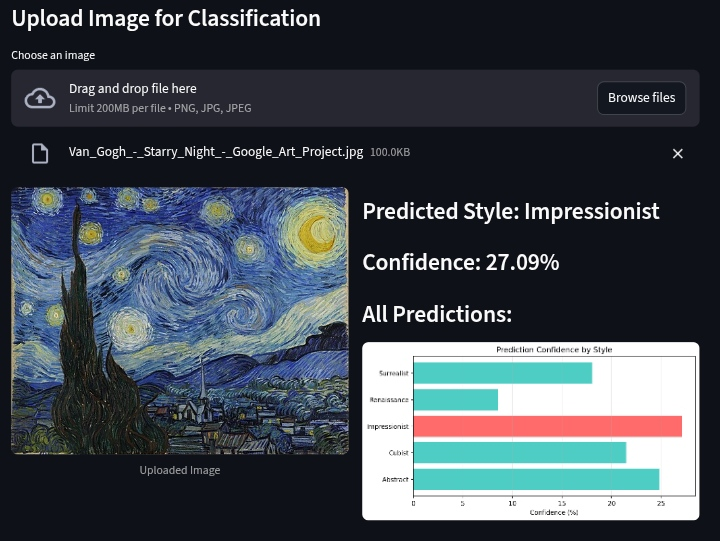
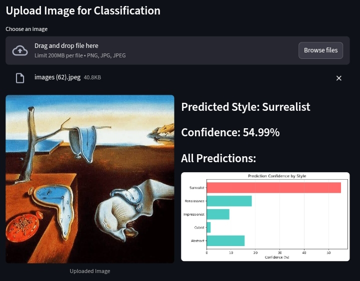

# Art Style Classifier

A deep learning application that uses transfer learning with EfficientNetB0 to classify artwork into different artistic styles.




## Features

- **Transfer Learning**: Uses pre-trained EfficientNetB0 model for high accuracy
- **9 Art Styles**: Classifies Abstract, Baroque, Cubist, Expressionist, Impressionist, Minimalist, Pop Art, Renaissance, and Surrealist styles.
- **Interactive Web Interface**: Built with Streamlit for easy use
- **Data Augmentation**: Improves model robustness with image transformations
- **Test-Time Augmentation**: Enhanced prediction accuracy
- **Class Balancing**: Prevents bias toward overrepresented classes
- **Real-time Training Progress**: Visual feedback during model training
- **Model Persistence**: Save and load trained models
- **Batch Classification**: Process multiple images at once

## Supported Art Styles
- 🌅 **Impressionist**
- 📐 **Cubist**
- 💭 **Surrealist**
- 🏛️ **Renaissance**
- 🎭 **Abstract**
- 🖼️ **Baroque**
- 🃏 **Expressionist**
- 🎨 **Pop Art**
- ➖ **Minimalist**

## Project Structure

```
.
├── app.py                  # Main Streamlit application
├── create_dataset.py       # Dataset generation script
├── main.py                 # Entry point (optional)
├── dataset/                # Training images organized by style
│   ├── Abstract/
│   ├── Cubist/
│   ├── Impressionist/
│   ├── Renaissance/
│   └── Surrealist/
├── models/                 # Saved trained models
│   └── class_names.json
├── pyproject.toml          # Python dependencies
├── .replit                 # Replit configuration
└── .streamlit/             # Streamlit configuration
    └── config.toml
```

## Getting Started

### On Replit

1. Click the "Run" button at the top of the Replit interface
2. The Streamlit app will automatically start on port 5000
3. Navigate through the sidebar to explore different features

### Local Development

#### Prerequisites

- Python 3.11 or higher
- UV package manager (or pip)

#### Installation

1. Clone the repository:
```bash
git clone <your-repo-url>
cd <project-directory>
```

2. Install dependencies using UV (recommended):
```bash
uv sync
```

Or install UV first if you don't have it:
```bash
curl -LsSf https://astral.sh/uv/install.sh | sh
uv sync
```

Alternatively, install from pyproject.toml with pip:
```bash
pip install matplotlib numpy pandas pillow scikit-learn seaborn streamlit tensorflow
```

3. Run the application:
```bash
streamlit run app.py --server.port 5000
```

### Using VS Code

See [VSCode.md](VSCode.md) for detailed instructions on setting up VS Code with this Replit project via SSH.

## Usage Guide

### 1. View Dataset

Navigate to the "📁 Dataset" page to:
- Browse existing images by art style
- Upload new images to expand the dataset
- Create new art style categories

### 2. Train Model

Go to "🎓 Train Model" to:
- Configure training parameters (epochs, batch size, validation split)
- Enable/disable data augmentation
- Monitor real-time training progress
- Save trained models

**Training Configuration:**
- **Epochs**: Number of training iterations (5-100)
- **Batch Size**: Images processed per iteration (8, 16, or 32)
- **Validation Split**: Percentage of data for validation (10-30%)
- **Data Augmentation**: Random transformations for better generalization

### 3. Classify Artwork

Navigate to "🔍 Classify" to:
- Upload and classify single images
- Process multiple images in batch mode
- View prediction confidence for all styles
- See visual confidence charts

### 4. View Metrics

Check "📊 Metrics" for:
- Training/validation loss curves
- Accuracy progression
- Model performance analysis

## Model Architecture

The classifier uses **EfficientNetB0** as the base model with:
- Pre-trained ImageNet weights
- Fine-tuned last 20 layers
- Custom classification head:
  - Dense layer (512 units) with L2 regularization
  - Batch normalization
  - Dropout (0.3, 0.4, 0.5) for regularization
  - Dense layer (256 units)
  - Softmax output layer

## Dataset

The project includes a pre-loaded dataset with 100 images per art style (500 total). You can expand this by:
1. Uploading images through the web interface
2. Adding images directly to the `dataset/` folders
3. Creating new style categories

**Image Requirements:**
- Formats: PNG, JPG, JPEG
- Recommended: At least 50 images per style for good training results
- Images are automatically resized to 128x128 pixels

## Dependencies

- **TensorFlow 2.20.0**: Deep learning framework
- **Streamlit 1.51.0**: Web application framework
- **NumPy 2.3.4**: Numerical computations
- **Pandas 2.3.3**: Data manipulation
- **Matplotlib 3.10.7**: Plotting and visualization
- **Seaborn 0.13.2**: Statistical visualizations
- **Pillow 12.0.0**: Image processing
- **scikit-learn 1.7.2**: Machine learning utilities

## Performance Tips

1. **Increase Dataset Size**: More training images = better accuracy
2. **Balance Classes**: Ensure similar image counts across all styles
3. **Use Data Augmentation**: Enable during training for better generalization
4. **Adjust Epochs**: Train longer for better convergence (20-50 epochs recommended)
5. **Learning Rate Reduction**: Automatically adjusts if validation plateaus

## Troubleshooting

### Training Error: Memory Issues
- Reduce batch size to 8 or 16
- Close other applications
- Use a smaller image size (modify `IMG_SIZE` in app.py)

### Low Accuracy
- Add more training images
- Increase training epochs
- Enable data augmentation
- Ensure dataset is balanced

### App Not Loading
- Check that port 5000 is available
- Restart the workflow
- Verify all dependencies are installed

## License

See [LICENSE](LICENSE) file for details.

## Contributing

Contributions are welcome! Please feel free to:
- Add new art style categories
- Improve model architecture
- Enhance the user interface
- Fix bugs or add features

## Credits

TensorFlow, and Streamlit.

## Support

For issues or questions:
- Open an issue in the repository
- Check [Streamlit documentation](https://docs.streamlit.io)
